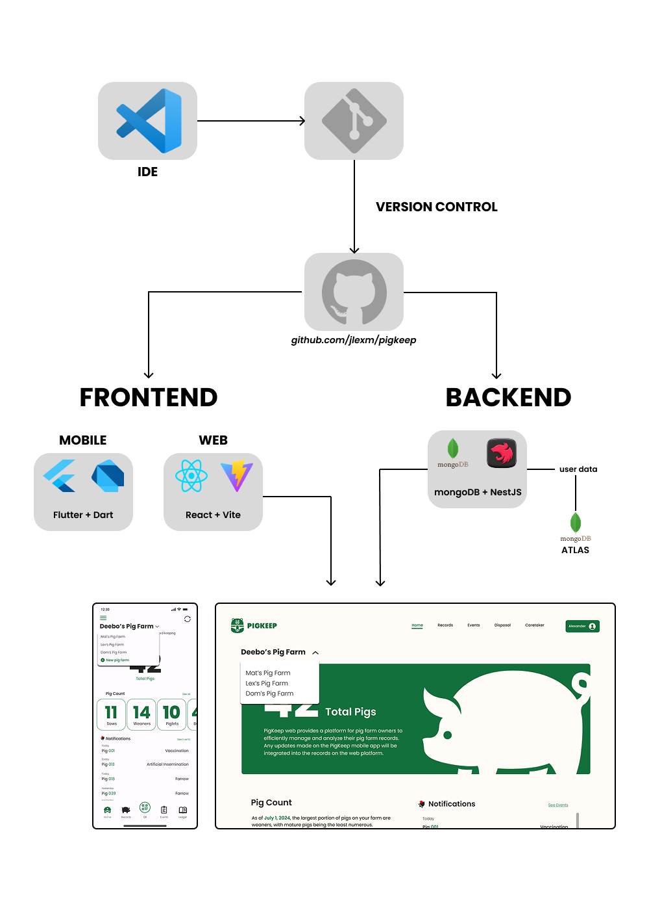

<div align="center">


# CAPSTONE PROJECT

### PigKeep: A QR-Enabled Pig Farm Monitoring and Management System

[View Live Demo](https://pigkeep.web.app/login) ~
[Download APK](https://drive.google.com/file/d/1-87PbhiFnFcIMTAy61vWOcDG6OZ2PDYH/view?usp=sharing)

</div>

<details>
<summary><b>Table of Contents</b></summary>

1. [About the Project](/README.md)

   - [Built With](/README.md#technology-stack)
   - [Resources Used](/README.md#resources-used)

2. [Getting Started](/README.md#getting-started-📌)

   - [Prerequisites](/README.md#prerequisites)
   - [Installation](/README.md#installation)
   - [Running Locally](/README.md#running-locally)

3. [Contributors](/README.md#gcontributors)

</details>

#### **About**

This repository pertains to our capstone project undertaken during the first semester of the academic year 2024-2025 at Ateneo De Naga University.

#### **Technology Stack**

[](https://skillicons.dev)



## **Getting Started** 📌

#### Prerequisites

Before running the application, make sure to install the following:

1.  NodeJS (NPM).

    Download and install NodeJS by following the instructions on their official [docs](https://nodejs.org/en/download).

    ```bash
    npm install npm@latest -g
    ```

2.  NestJS.

    Download and install NestJS by following the instructions on their official [docs](https://docs.nestjs.com/first-steps).

    ```bash
    npm i -g @nestjs/cli
    ```

3.  Flutter & Dart.

    Download and install Flutter by following the instructions on their official [docs](https://docs.flutter.dev/get-started/install).

    To verify installation.

    ```bash
    flutter doctor
    ```

#### Installation

1.  Clone this repository

    ```bash
    git clone https://github.com/jlexm/pigkeep.git
    ```

    Upon cloning, navigate to the repo.

2.  To install or update packages

    - For the backend, navigate to the `backend` directory:

      ```bash
      cd backend
      npm install
      ```

    - For the web frontend, navigate to the `admin` directory:

      ```bash
      cd admin
      npm install
      ```

    - For the mobile frontend, navigate to the `client_app/pig_keep` directory:

      You have the option to run the mobile application either on an emulator via Android Studio or on a physical device. You can learn more on flutter's official [docs](https://docs.flutter.dev/get-started/install/windows/mobile).

      ```bash
      cd client_app/pig_keep
      flutter pub get
      ```

    That's it! You can now start by running the application.

#### Running Locally

1.  Run the backend

    You can modify your script to run the application on:

    ```bash
    cd backend/package.json
    ```

    then:

    ```bash
    npm run start:dev
    ```

2.  Run the frontend
    - For Mobile:
      ```bash
      flutter run
      ```
    - For Web:
      ```bash
      npm run start:dev
      ```

## License 📋

This project is licensed under the MIT License - see the [LICENSE](LICENSE) file for details.

## **Contributors**

We greatly appreciate contributions to this project. Special thanks to the following contributors for their valuable input and efforts:

- [Alex Maravilla](https://github.com/jlexm)
- [Mathew Talagtag](https://github.com/mathewwww)
